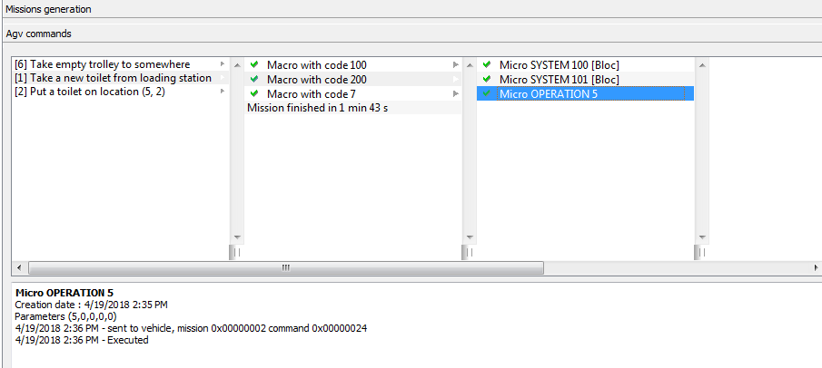

**************************
Demo 03: Storage example
**************************

In this example we will see how to handle a store with one agv. Let's suppose that use have a store with a matrix layout, one loading station and two unloading stations.
The loading unit is a pallet. The agv go to the loading area with an empty pallet, a worker load the product manually on the pallet, once finish the Agv take the full pallet to the store. After a specific time the agv take out the pallets from the store to the unloading area following the FIFO (First In First Out) logic. The Agv leave the pallet in one unloading area, then go to the store to take another pallet or to the loading station to take some products. Keep in mind that the Agv need a pallet on board in order to load products, for this reason the Agv may take an empty pallet from the unloading area (if worker have already free the pallet from products) or turn back to the store to take an empty pallet then go to the loading area.

:download:`Here is the complete project <listing/demo_store/10_Workshop.7z>`

Missions
=========

First of all we have to identify the missions in order to accomplish the requirements. It si relativley simple to do it. It is enough to write what the agv have to do in sequence, than figure out some special cases.
For example a normal working flow is:

	- the Agv have to take a product from the loading station
	- then take it into the store
	- then take out the product from the store
	- then take it to the unloading area

This normal flow is composed by 4 missions. We say that the agv need a pallet on board in order to load products, so we need to take some pallet from somewhere. Let's say we can take empty pallets from the store or from the unloading area if the worker have already free the pallet. So we have other 2 missions.

	- take empty pallet from store
	- take empty pallet from unloading area.

Let's say the worker free the pallet in the unloading area, and we have to take out a full pallet from the store, before doing this we have to take out the empty pallet from the unloading area. Then take it to the store or to load products, notes that these 2 missions are already identified.

	- take empty pallet out from the unloading area

Now suppose that we don't have anything to do and we have to wait to decide what to do, so we have a Null mission.

The agv use battery as power source, so a further mission could be: go to charging station. If the working time finish, at he end of the day we can decide to send the agv to some parking position: home position mission.
We can figure out other mission, but for this example these missions are enough. Identified mission are summarized in the following listing:

.. code-block:: none

  // Missions
  $define MIS_NULL							0		// Nothing to do
  $define MIS_LOAD_TOILET_FROM_STATION		1		// Go to loading station to take a trolley
  $define MIS_PUT_TOILET_TO_STORE				2		//  Take the toilet to the store
  $define MIS_LOAD_TOILET_FROM_STORE			3		// Take something out of store
  $define MIS_LOAD_EMPTY_TROLLEY_FROM_STORE	4		// Take something out of store
  $define MIS_TAKE_TOILET_TO_UNLOAD			5		// Take the toilt already on agv to unloading station
  $define MIS_EMPTY_TROLLEY_FROM_UNLOAD		6		// Go take an empty trolley from unload area
  $define MIS_PUT_EMPTY_TROLLEY_ON_STORE		7		// Agv has an empty trolley, put it on store

  $define MIS_LOAD_ONLY						10
  $define MIS_UNLOAD_ONLY						11
  $define MIS_TO_BATTERY_CHARGE				12
  $define MIS_TO_HOME							13
  $define MIS_TO_POINT						14

The main logic of assigning missions will be implemented in the function ``onNextMission()``. After assigning a mission a macro list have to be compiled, and it will be done in another function, called from ``onNextMission()``.

onNextMission()
================

Have a look on the main loop execution, fig. :ref:`agvScript#figmainLoop` to get an idea about when the callback function is called or read the documentation. Now let's assign some mission to the agv.

First let's read the state of the AGV by calling ``AgvGetVehicleInfo(uAgv, @agvInfo)`` where ``uAgv`` is the Agv index and ``agvInfo`` is a ``XVehicleInfo``. From the variable ``agvInfo`` we can get information about the battery capacity of the Agv, the status of the Agv, etc.

We have to check if the Agv have enough power to execute a mission, and if the Agv have a pallet (UDC) on board or not, if it have a pallet, it is empty or have some product?
Let's define two flags in the agv flag status, ``agvInfo.uStatus``. One to determine if the full pallet on the agv come from the store or from the loading area? For example ``agvflg_ProductGoingOutOfStore=TRUE`` then it is a pallet that come out from the store and should go to unloading area, otherwise if equal ``false``, it come the loading area and have to go to the store.
The other flag to determine if the pallet is empty or not, ``agvflg_ProductOnPallet``.

.. code-block:: none

  ; user defined vehicle status flags
  $define agvflg_ProductOnPallet			0x0100   ; bit 8 in agvInfo.uStatus
  $define agvflg_ProductGoingOutOfStore	0x0200 ; bit 9 in agvInfo.uStatus

Then let's defined some boolean variables that will help in the decision and selection of missions:

.. code-block:: none
  :caption: Desision variables or plant status

  bool mustGoToChargeBattery ; no pwer, Agv must go the cahrg
  bool trolleyOnAgv	; Agv have pallet or loading unit, don't consider the product
  bool toiletOnTrolley ; Agv have a full pallet = Loading unit + product
  bool takeOutToilet ; Full pallet come out from store

  ; Unloading unit have empty trolley to take away
  bool mustRemoveTrolleyFromUnload

  mustGoToChargeBattery = (agvInfo.dBatteryPerc <= MIN_BATTERY)

  trolleyOnAgv = (agvInfo.uStatus & VST_CARICO_PRESENTE)
  toiletOnTrolley = trolleyOnAgv and (agvInfo.uStatus & agvflg_ProductOnPallet)
  takeOutToilet = toiletOnTrolley and (agvInfo.uStatus & agvflg_ProductGoingOutOfStore)

Depending on the value of these variables we can assign mission to Agv. For example if the agv `have a full pallet on board and that pallet come out from the store, it should go to the unloading area`.

.. code-block:: none
  :caption: Mission to unloaing area

  if (takeOutToilet)
  	OnNextMissionDebugMessage(uAgv, "takeOutToilet=T : assign mission MIS_TAKE_TOILET_TO_UNLOAD")
  	return RegisterMission(uAgv, MIS_TAKE_TOILET_TO_UNLOAD)
  endif

The function ``OnNextMissionDebugMessage()`` is used to show debugging messages in **the vehicle information [F3]** tab, in the box **Mission generation**.

If the Agv `have a full pallet and the pallet doesn't come out from the store, it come from the loading are`, the agv have to take the pallet to the store:

.. code-block:: none
  :caption:  Mission take full pallet into store

  if (toiletOnTrolley)
  	int storePosition
  	// Find a position on the store where to put the trolley
  	storePosition = store_hnd.positionForTakeInTrolley(uAgv, true)
  	if (not SiteExists(storePosition))
  		OnNextMissionDebugMessage(uAgv, "toiletOnTrolley=T : position in store not found")
  		return MIS_NULL
  	endif
  	OnNextMissionDebugMessage(uAgv, "toiletOnTrolley=T, storePosition=" + storePosition + " : assign mission MIS_PUT_TOILET_TO_STORE")
  	return RegisterMission(uAgv, MIS_PUT_TOILET_TO_STORE, storePosition)
  endif

If we look at the code again without the debugging info, it is simple. First we choose a position in the store where to go, then we assign the mission take trolley to the position chosen in the store.

.. code-block:: none

  if (toiletOnTrolley)
  	int storePosition
  	// Find a position on the store where to put the trolley
  	storePosition = store_hnd.positionForTakeInTrolley(uAgv, true)
  	//check if postion exist or storePosition <> (-1), register mission.
  	return RegisterMission(uAgv, MIS_PUT_TOILET_TO_STORE, storePosition)
  endif

As we see the logic to assign Missions should not be complicated. Once missions are identified, it is enough to assign them to Agv without caring about the details of a mission. To do so, we call a user defined function ``RegisterMission(uAgv, uMission, iPar1, iPar2)``, or any number of parameters we need. The detail about mission step (MACROs) are implemented in the function ``registerMission``.

Until now we assign 2 missions ``MIS_TAKE_TOILET_TO_UNLOAD`` and ``MIS_PUT_TOILET_TO_STORE``, depending on the conditions ``takeOutToilet`` and ``toiletOnTrolley``.

Pay attention to the sequence of implementing the functions or to the conditions. It is better to write ``if (toiletOnTrolley and not takeOutToilet)`` then writing ``if (toiletOnTrolley)``, in this way we don't care about the sequence of writing the conditions.

Macros
=======

Once missions are defined, we have to defined MACROs. First take a look at macros defined by AgvManager.

.. code-block:: none

  // MACRO code definition
  $define MAC_NULL             0
  $define MAC_MOVE_TO_USER     1
  $define MAC_MOVE_TO_XY       2
  $define MAC_CHARGE_BATT      3
  $define MAC_CHARGE_STOP      4
  $define MAC_LOAD             5
  $define MAC_UNLOAD           6
  $define MAC_END              7
  $define MAC_MOVE_AND_LOAD    8
  $define MAC_MOVE_AND_UNLOAD  9

If other macros are needed we can define also ours.

.. code-block:: none

  // Movement to waypoint
  $define MAC_MOVE_TO_WP					100
  // Wait for the amount of seconds specified in par1
  $define MAC_WAIT_S						101
  // Load a trolley from the point defined by par1
  // par2 is true if there is a toilet on the trolley
  $define MAC_LOAD_TROLLEY				102
  // Unload a trolley on the point defined by par1
  $define MAC_UNLOAD_TROLLEY				103

  // Wait for the operator to load toilet on agv
  $define MAC_WAIT_TOILET					200
  // Decide the unloading point where the toilet will be unloaded
  $define MAC_TAKE_TOILET_TO_UNLOAD		201
  // Decide where to take an emty trolley: whether to load station or to store
  $define MAC_DECIDE_EMPTY_TROLLEY_DEST	202

To define Macros, we go back to the list of missions, and write the detail of the missions. Once again without too much detail, becuase the instructions and operations sent to and received from agv are handled by MICROs.
For our example we can assign the following macros to each mission. Usually this is done in register mission, or a fucntion called from ``onNextMission()``.

- MIS_LOAD_TOILET_FROM_STATION	1
		* MAC_MOVE_TO_WP , move to station user point
		* MAC_WAIT_TOILET , wait loading toilet, wait for signal load ok
		* MAC_END
- MIS\_PUT\_TOILET\_TO\_STORE		2
		* MAC\_MOVE\_TO\_WP , move to the store position
		* MAC\_UNLOAD\_TROLLEY , unload trolley
		* MAC\_MOVE\_TO\_WP , go out from store
		* MAC\_END , end macro

- MIS\_LOAD\_TOILET\_FROM\_STORE	3
		* MAC\_MOVE\_TO\_WP
		* MAC\_LOAD\_TROLLEY
		* MAC\_MOVE\_TO\_WP
		* MAC\_END

- MIS\_LOAD\_EMPTY\_TROLLEY\_FROM\_STORE 4
		* MAC\_MOVE\_TO\_WP
		* MAC\_LOAD\_TROLLEY
		* MAC\_MOVE\_TO\_WP
		* MAC\_END

- MIS\_TAKE\_TOILET\_TO\_UNLOAD 5
		*
		* MAC\_MOVE\_TO\_WP
		* MAC\_TAKE\_TOILET\_TO\_UNLOAD
		*

- MIS\_EMPTY\_TROLLEY\_FROM\_UNLOAD 6
		* MAC\_MOVE\_TO\_WP
		* MAC\_LOAD\_TROLLEY
		* MAC\_MOVE\_TO\_WP
		* MAC\_DECIDE\_EMPTY\_TROLLEY\_DEST

- MIS\_PUT\_EMPTY\_TROLLEY\_ON\_STORE 7
		* MAC\_MOVE\_TO\_WP , move to the store position
		* MAC\_UNLOAD\_TROLLEY , unload trolley
		* MAC\_MOVE\_TO\_WP , go out from store
		* MAC\_END , end macro

Once MACROs are assigned to missions, we have to assign MICROs to MACROs, this may be done in ``onExpandMacro()``. Remember that when ``onExpandMacro()`` return ``true``, mean the execution of the current macro is concluded, and the next macro in the list will be expanded (executed) on the next call of ``onExpandMacro()``, of course if the current macro is not the last one in the list.

We can also end a mission and begin another one from ``onExpandMacro()``. We don't have to do it always in ``onNextMission()``. But keep in mind that the program should be linear and simple. Avoid **spaghetti code** when is possible.

When a macro is expanded we can see the result in **vehicle information[F3]**, fig. :ref:`figmacroexp`.

.. _figmacroexp:

    Macro expansion and micro details

For example to make a loading operation, we have to call ``AgvRegisterOperation()``, as in listing :ref:`lstMACLoad`.

.. code-block:: none
  :caption: Loading MACRO
  :name: lstMACLoad

  case MAC_LOAD_TROLLEY
  	// par1 is the point
  	// par2 is true if there is a toilet on the trolley
  	// par3 is true it the trolley is ready to be taken out of store
  	AgvRegisterOperation(uAgv, uMission, O_LOAD, iPar2, iPar3, 0, 0, iPar1)
  	break

The call of AgvRegisterOperation in :ref:`lstMACLoad`, register a MICRO of type ``MIC_OPERATION``.

Micros and Operations
======================

Micros are low level set of instructions. The following listing.:ref:`lstMIC` show the different categories of micro instructions or operations defined by AgvManager.

.. code-block:: none
  :caption: Different catergory of MIC defined in AgvManager
  :name: lstMIC

  // Definizione codici micro
  $define MIC_NULL              0
  $define MIC_MOVE              1 // M command, agvregisterMove****
  $define MIC_CURVE             2 // M command
  $define MIC_ROTATION          4 // M command
  $define MIC_OPERATION         5 // O command, agvregisterOperation()
  $define MIC_SYSTEM            6 //   command are not sent to vehicle, agvregistersystembloccante(), agvregistersystempassante()
  $define MIC_PASSANTE          7 // P command, agvregisterPassante()
  $define MIC_WAIT              8 // W command, agvregisterWait()
  $define MIC_MOVING_OPERATION  9 // Q command, agvregisterMovingOperation()

The following are MICROs defined by AgvManger.

.. code-block:: none
  :caption: MICRO and OPERAIONS defined by AgvManager
  :name:

  // Definizione codici operazioni
  $define O_LOAD          2
  $define O_UNLOAD        3
  $define O_CHARGE        4
  $define O_CHARGE_START  1
  $define O_CHARGE_STOP   2

  // Definizione codici micro System
  $define S_NULL          0	// Serve (ad esempio) a spezzare le MIC_MOVE
  $define S_END           1
  $define S_CHARGE_WAIT   3
  $define S_CHARGE_START  4
  $define S_CHARGE_STOP   5
  $define S_CONCAT_MACRO  8	// Concatena immediatamente la macro successiva

We can define are own Micros and operations. Try to follow the naming style of AgvManager. Begin with the prefix ``O_`` for Operation category, with ``S_`` for System category.

.. code-block:: none
  :caption: MICRO and OPERAIONS defined by user
  :name:

  //	Micro SYSTEM
  $define S_START_WAIT		100
  $define S_EXEC_WAIT			101

  //	Micro OPERATION
  // Wait toilet on agv
  $define O_WAIT_TOILET		5

Micros form category ``MIC_OPERATION``, ``MIC_SYSTEM``, ``MIC_PASSANTE``, ``MIC_WAIT`` are assigned in ``onExpandMacro()``, using one of the following functions:

.. code-block:: none

  // Blocking operation
  AgvRegisterOperation()
  // passthrough operation
  AgvRegisterPassante()
  // Operation during motion
  AgvRegisterMovingOperation()

  //
  AgvRegisterWait()
  AgvRegisterSystemPassante()
  AgvRegisterSystemBloccante()

Micros that belong to ``MIC_MOVE``, ``MIC_CURVE``, ``MIC_ROTATION`` are assigned by ``AgvMoveTo****()`` functions.

Micro execution is done in ``onExecuteMicro()``, for example:

.. code-block:: none

  case MIC_SYSTEM
  	case S_END
  		; End of mission
  		AgvStopMission(uAgv)
  		SetAgvMessage(uAgv, "")
  		break

  	case S_START_WAIT
  	// start timer. Not locking micro
  		timerWait[uAgv] = timeoutS(iPar1)
  		break

  	case S_EXEC_WAIT
  	// wait a timer to finish counting. locking micro
  		if (isTimeout(timerWait[uAgv]))
  			return true
  		else
  			MultiMessageState(uAgv, "Agv " + (uAgv + 1) + " : wait " + int(secsToTimeout(timerWait[uAgv])) + "s")
  		return false
  		endif
  		break

  	case S_WAIT_INPUT
  	// wait a signal from plc. locking micro
  		if ( AgvGetInput(INP_LOAD_TERMITAED) ==false )
  			return true
  		else
  			return false
  		endif

Keep in mind that when a micro terminate, ``onExecuteMicro()`` should return true. For example, if we are waiting for a signal to be false, and the signal is true, ``onExecuteMicro()`` return ``false``, in this way the next micro will be the current one.
When the signal become false,``onExecuteMicro()`` return true and the execution of the current micro terminate.

When ``bLastCall`` will be set to ``true``? at the next execution or immediately, and the effective termination will be at the next call?

.. code-block:: none
  :caption: Loading MIC OPERATION
  :name: lstOLOAD

  case O_LOAD
  	if (bLastCall)
  		MultiMessageState(uAgv, "Agv " + (uAgv + 1) + " : loaded from " + userId)
  		SetAgvMessage(uAgv, "")
  		// Agv has finished the load:
  		// AgvExecLoad() puts the logical content of the user point identified by userId
  		// on the agv, and removes from the user point.
  		// NOTE: the operation was sent to the agv in OnExpandMacro()
  		// expanding the macro MAC_LOAD_TROLLEY
  		AgvExecLoad(uAgv, userId)
  		// Position is no more reserved to agv
  		store_hnd.unassignAgvToLocation(uAgv, userId)
  		return true
  	else
  		MultiMessageState(uAgv, "Agv " + (uAgv + 1) + " : loading from " + userId)
  		SetAgvMessage(uAgv, "Loading")
  		return false
  	endif
  	break

For example if we register a micro from the category Operation, AgvManager will send some command to the vehicle. When the vehicle answer with operation concluded, AgvManager will set ``bLastCall`` to ``true``, in this way we can terminate the micro execution.

From AgvManager we can send command to agv from the interpreter box. For example the operation command structure is: ``[Occccmmmm,type,p1,p2,p3,p4]``. For example [O\textcolor{blue}{0001}\textcolor{red}{0003},1,0,0,0,0], fig.:ref:`figoperationCmd`, we send to Agv an operation command ``[O]``, with operation number 1 and mission number 3.

.. _figoperationCmd:

    Commands insertion

Details about mission, macro and micro execution can be seen in the tab **vehicle informations[F3]**.

Store handling
===============

In a matrix store, or stack, products can be taken out following the logic of First in **First out (FIFO)** or **Last in First out(LIFO)**, etc.

We can define some objects to handle the store, keep in memory the products in the store and track them, and also some algorithm to take out or take in products.
